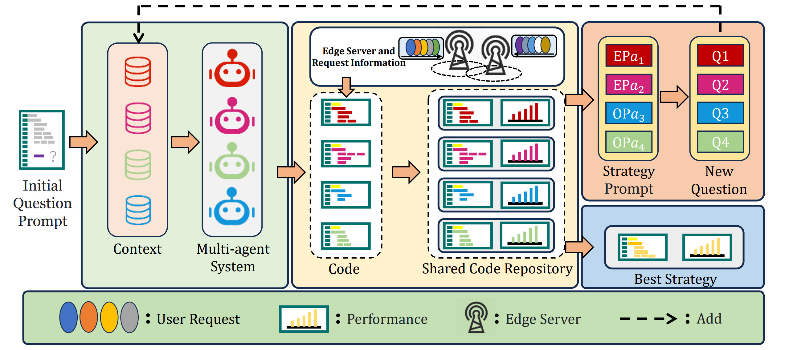
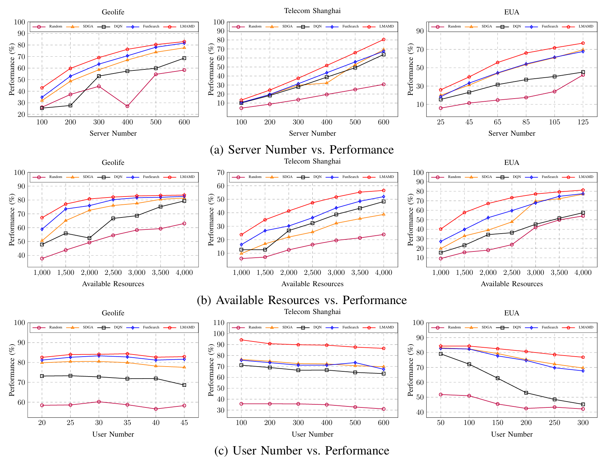

# LMAMD
## Abstract
Microservice deployment in resource-constrained edge environments remains challenging. While the architecture demonstrates adaptability, conventional methods have two critical limitations: (1) heavy reliance on manual configuration for dependency resolution and (2) computationally intensive optimization processes that hinder rapid deployment. To address these problems, we propose large language models (LLMs)-powered multi-agent microservice deployment strategy generation framework (LMAMD) that automates deployment strategy design through collaborative reasoning. Our approach leverages LLMs' capabilities in constraint analysis, task decomposition, and distributed decision-making. Experimental validation across three real-world datasets of varying scales demonstrates that, compared with baseline methods implemented based on various concepts, the LMAMD outperforms the performance of microservice deployment strategies under different parameter conditions. This work pioneers a new direction for intelligent edge orchestration by synergizing LLM-based cognitive agents with microservice system dynamics. The code can be found at https://anonymous.4open.science/r/LMAMD.


## Results


## Usage
- We have placed sample files for various parameters of each dataset.

- Enter the directory src and start LMAMD
  ```bash
  python "main.py"
  ```
## ACKNOWNLEDGES
The links to the original data are below.
<span id="citation-1"></span>
- Geolife: https://www.microsoft.com/en-us/download/details.aspx?id=52367
- Telecom Shanghai: https://www.kaggle.com/datasets/mexwell/telecom-shanghai-dataset
- EUA: https://github.com/PhuLai/eua-dataset 


